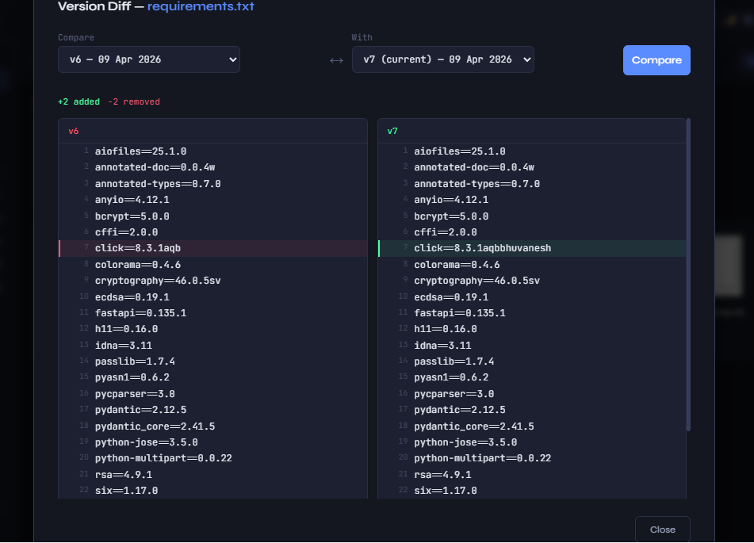
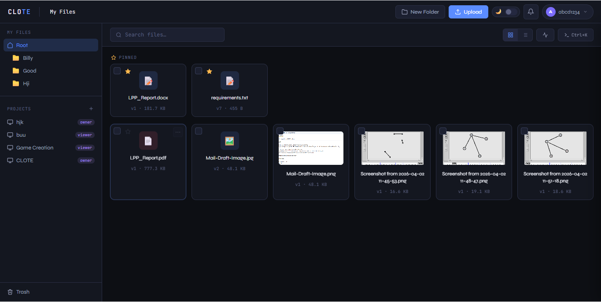
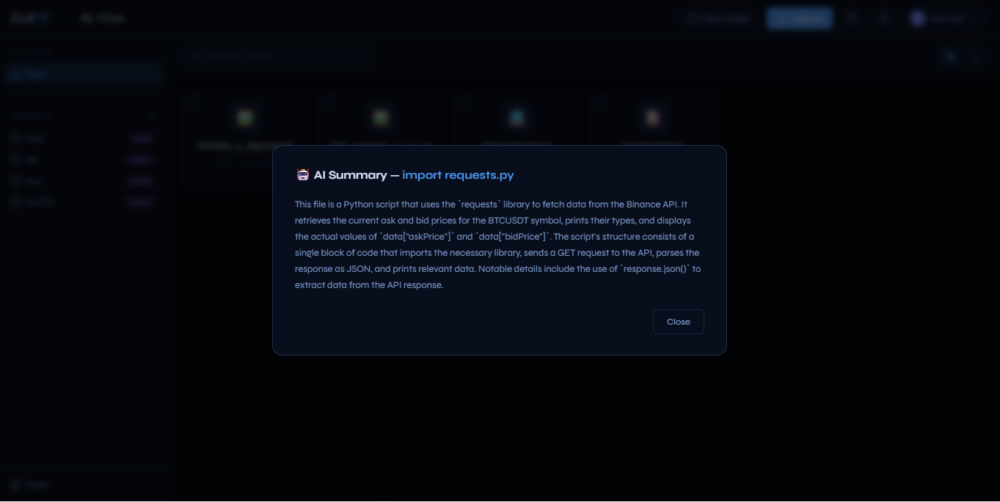

# 🚀 CLOTE — Self-Hosted File Management System


> Own your files. Run your cloud. No subscriptions, no third parties.

**CLOTE is a self-hosted alternative to cloud storage platforms like Google Drive and Dropbox, built for privacy, control, and extensibility.**

Upload, organize, share, and interact with your files — all running locally on your own machine or server.

---

## ✨ Features

* 📁 File & Folder Management — upload, download, organize, rename, delete
* 🗂️ Projects — group files into workspaces
* 🔗 File Sharing — generate share links for files
* 🗑️ Trash & Restore — soft-delete with recovery
* 📦 Bulk Operations — select and act on multiple files at once
* 📜 Audit Logs — track every action (who, what, when)
* 🤖 AI Assistant — chat with your files using a local LLM via Ollama
* 🔐 JWT Authentication — secure login with encrypted passwords
* 🗃️ File Versioning — keeps previous versions of updated files
* 🌐 Remote Access — works over Tailscale VPN without exposing to internet

---

## 💡 Why CLOTE?

* No vendor lock-in — your data stays with you
* Fully self-hosted — no external dependency
* Built-in AI assistant (local, privacy-first)
* Simple deployment using Docker
* Lightweight yet powerful alternative to cloud storage tools

---

## 📸 Screenshots

> (Add your screenshots in `docs/images/`)

### Dashboard



### File Management



### AI Assistant



---

## ⚡ Quick Start (Docker — Recommended)

**Requirements:** Docker

```bash
git clone -b dev https://github.com/nithishvenkat4/CLOTE.git
cd CLOTE
cp .env.example .env
# Edit SECRET_KEY inside .env

docker compose up -d
```

Open: http://localhost:8000

**Stop:**

```bash
docker compose down
```

---

## 🧪 Manual Setup (Without Docker)

**Requirements:** Python 3.13+

```bash
git clone -b dev https://github.com/nithishvenkat4/CLOTE.git
cd CLOTE/server

python -m venv venv
venv\Scripts\activate        # Windows
# source venv/bin/activate   # Linux/Mac

pip install -r requirements.txt

cp ../.env.example ../.env   # fill in SECRET_KEY

uvicorn main:app --host 0.0.0.0 --port 8000 --reload
```

---

## ⚙️ Environment Variables

Copy `.env.example` to `.env` and configure:

| Variable                      | Description                   | Default                  |
| ----------------------------- | ----------------------------- | ------------------------ |
| `SECRET_KEY`                  | JWT signing secret (required) | —                        |
| `ACCESS_TOKEN_EXPIRE_MINUTES` | Session duration              | `60`                     |
| `ALLOWED_ORIGINS`             | CORS origins                  | `*`                      |
| `SMTP_USER`                   | Email for notifications       | optional                 |
| `SMTP_PASS`                   | Email app password            | optional                 |
| `OLLAMA_HOST`                 | Ollama server URL             | `http://localhost:11434` |
| `OLLAMA_MODEL`                | LLM model to use              | `llama3.2`               |

---

## 🤖 AI Features (Optional)

CLOTE can connect to a local Ollama instance for AI-powered file interaction.

```bash
ollama pull llama3.2
```

Set `OLLAMA_HOST` and `OLLAMA_MODEL` in your `.env`.
If Ollama is not running, all other features work normally.

---

## 🧱 Project Structure

```
CLOTE/
├── client/
│   └── CLOTE.html
├── server/
│   ├── main.py
│   ├── auth.py
│   ├── config.py
│   ├── database.py
│   ├── requirements.txt
│   ├── routes/
│   │   ├── auth_routes.py
│   │   ├── file_routes.py
│   │   ├── folder_routes.py
│   │   ├── project_routes.py
│   │   ├── share_routes.py
│   │   ├── trash_routes.py
│   │   ├── bulk_routes.py
│   │   ├── audit_routes.py
│   │   └── ai_routes.py
│   └── storage/
│       ├── files/
│       └── versions/
├── Dockerfile
├── docker-compose.yml
├── .env.example
└── install.sh
```

---

## 🐧 Linux Server Install (One Command)

```bash
sudo bash install.sh
```

Installs CLOTE as a systemd service that starts automatically on boot.

---

## 📡 API Docs

When running, visit:

http://localhost:8000/docs

for interactive Swagger API documentation.

---

## 🔮 Future Improvements

* Web-based multi-user management
* Mobile-friendly UI
* External storage integrations
* Advanced search & indexing
* Role-based access control

---

## 🤝 Contributing

Contributions are welcome!
Feel free to fork the repo and submit a pull request.

---

## 📄 License

MIT — free to use, modify, and self-host.

---

## 👨‍💻 Author

Built by Nithish V
https://github.com/nithishvenkat4
